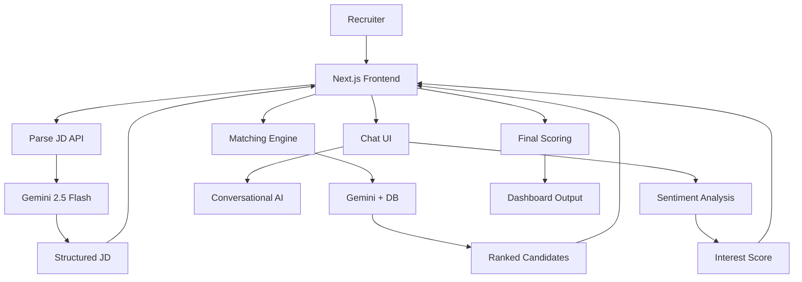

# 🚀 AI-Powered Talent Scouting & Engagement Agent
**Built for the Catalyst Hackathon**

🔗 **[Live Vercel Prototype](https://catalyst-ai-recruiter.vercel.app/)**
📹 **[Demo Video Link](https://drive.google.com/file/d/17xgFWCRCJal_sXcWjdk3Ak1Dc5j2qFo6/view?usp=drive_link)**

## Overview
Recruiters waste countless hours manually parsing resumes and chasing cold leads. This AI Agent automates the top-of-funnel recruitment process. It takes a raw Job Description, parses it for requirements, scans a candidate database, and ranks the best fits. It then simulates a conversational outreach to assess the candidate's actual enthusiasm, outputting a highly actionable dashboard scored on three dimensions: **Match Score**, **Interest Score**, and a combined **Overall Score**.

## 🏗️ System Architecture

## 🧠 Scoring Logic & Combined Output
Our platform solves the "ghosting" problem in tech recruiting by evaluating candidates on multiple dimensions to provide a single, actionable metric:

Match Score (0-100): Generated via semantic matching. The AI compares the parsed JD requirements (skills, years of experience) against the candidate's static profile and bio.

Interest Score (0-100): Generated via behavioral analysis. The AI acts as a recruiter in a simulated chat. Once the chat concludes, a separate AI route analyzes the transcript. Short, unenthusiastic answers result in a low score, while detailed, context-aware answers result in a high score.

Overall Score (Combined Rank): To provide a final, actionable ranking as required by the problem statement, the system calculates the combined average of the Match and Interest scores. This allows recruiters to instantly prioritize candidates who are both highly qualified and highly engaged.

📥 Sample Inputs & Outputs
Sample Input (Job Description):

"We are looking for a Full-Stack Engineer with 3+ years of experience. Must have deep technical proficiency in the MERN stack (MongoDB, Express, React, Node.js) and hands-on experience with WebSockets or Socket.io to build real-time chat applications."

Sample Output (Parsed & Ranked):

Candidate: Mateo Alvarez

Parsed JD: Title: Full-Stack Engineer | Experience: 3+ years | Skills: MERN stack, WebSockets, Socket.io

Match Score: 95/100

Reasoning: "Mateo is an excellent full-stack engineer with strong Node.js and React skills, and his background in real-time communication systems aligns perfectly with the Socket.io requirements."

Interest Score: 85/100 (Post-simulation chat)

Overall Score: 90/100 (Final Combined Rank)

💻 Local Setup Instructions
If you wish to run this application locally instead of using the Vercel prototype:

Clone the repository:
git clone https://github.com/YOUR_USERNAME/catalyst-ai-recruiter.git

Install dependencies:
npm install

Create a .env.local file in the root directory and add your Gemini API key:
GEMINI_API_KEY=your_api_key_here

Run the development server:
npm run dev

Open http://localhost:3000